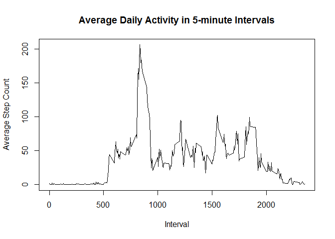

# Reproducible Research: Peer Assessment 1


## Loading and preprocessing the data

```r
unzip("activity.zip")
activity <- read.csv("activity.csv")
```

## What is mean total number of steps taken per day?

```r
## Add up all the steps for each day.
## This form of aggregate() ignores missing values.
##
totalStepsByDay <- aggregate(steps ~ date, activity, "sum")
hist(totalStepsByDay$steps, 
     main = "Histogram of Total Steps Per Day",
     xlab = "Steps Per Day")
```

 

```r
mean <- mean(totalStepsByDay$steps)
median <- median(totalStepsByDay$steps)
```
The mean is 10766.19 steps per day.  
The median is 10765 steps per day.

## What is the average daily activity pattern?

```r
## Compute the mean of steps in each interval over all the days.
## This form of aggregate() ignores missing values.
##
meanStepsByInterval <- aggregate(steps ~ interval, activity, "mean")
plot(meanStepsByInterval,
     main="Average Daily Activity in 5-minute Intervals",
     xlab="Interval",
     ylab="Average Step Count",
     type="l")
```

 

```r
maxInterval <- meanStepsByInterval$interval[which.max(meanStepsByInterval$steps)]
```
The interval with the maximum number of steps is interval 835


## Imputing missing values

```r
numMissing <- sum(is.na(activity$steps))
```
The number of rows with missing values is 2304

```r
## Replace any missing interval value with the overall average for that interval
## obtained from the previous step.
##
imputed <- activity
inds <- which(is.na(imputed$steps))
for (i in inds) {
    interval <- imputed$interval[i]
    value <- meanStepsByInterval$steps[meanStepsByInterval$interval == interval]
    imputed$steps[i] <- value
}

## Same histogram as above, but use imputed data.
##
totalStepsByDay <- aggregate(steps ~ date, imputed, "sum")
hist(totalStepsByDay$steps, 
     main = "Histogram of Total Steps Per Day (Imputed Data)",
     xlab = "Steps Per Day")
```

 

```r
imputedMean <- mean(totalStepsByDay$steps)
imputedMedian <- median(totalStepsByDay$steps)
```
The mean is 10766.19 steps per day.  
The imputed mean is 10766.19 steps per day.  
The median is 10765 steps per day.  
The imputed median is 10766.19 steps per day.

## Are there differences in activity patterns between weekdays and weekends?

```r
library("lattice")
days <- weekdays(as.POSIXlt(imputed$date))
imputed$dayType <- as.factor(ifelse(days %in% c("Saturday", "Sunday"), "weekend", "weekday"))
meanStepsByInterval <- aggregate(steps ~ interval + dayType, imputed, "mean")
xyplot(steps ~ interval | dayType,
       data = meanStepsByInterval,
       main="Comparison of Activity Between Weekends and Weekdays",
       type="l",
       layout=c(1,2))
```

 
